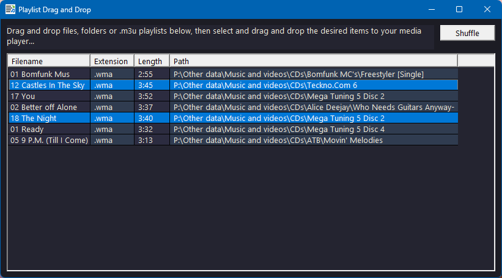

# PlaylistDnD: Playlist Drag and Drop

PlaylistDnD acts as an intermediate between media files and good media players that support drag and drop of media files but have some missing playlist management features. 

It allows you to create and manage a playlist by dragging and dropping media files, folders, or `.m3u` playlists directly into the application. You can then select and drag the desired items from the PlaylistDnD playlist to your favorite media player.

  

Tips:
- PlaylistDnD can be used to quickly drop its playlist to the "Automix" tab of [VirtualDJ](https://www.virtualdj.com/).
- Use the typical ways to select multiple items in the playlist (e.g. `Ctrl` + click, `Shift` + click, `Ctrl` + `A`, `Esc`, `Del`) and then drag and drop the selected items to the media player.
- When dragging and dropping an element to another position in the playlist, directly use the `Del` key to remove it from its original position if moving (instead of duplicating) was the intention (whether it was a single element or the selection of multiple ones).
- To repeat some elements, simply drop them multiple times. Clicking on the `Shuffle` button can then randomize the order of the playlist, with the duplicates appearing randomly multiple times. For short playlists, this can be sometimes better than a pure random function, which theoretically could play any song multiple times while never playing some other songs.
- Use e.g. [Media Player Classic - Home Cinema](https://codecguide.com/download_k-lite_codec_pack_mega.htm) for complementary `.m3u` playlist management features (e.g. drag and drop PlaylistDnD current playlist to MPC-HC to be able to save it as a `.m3u` file).
